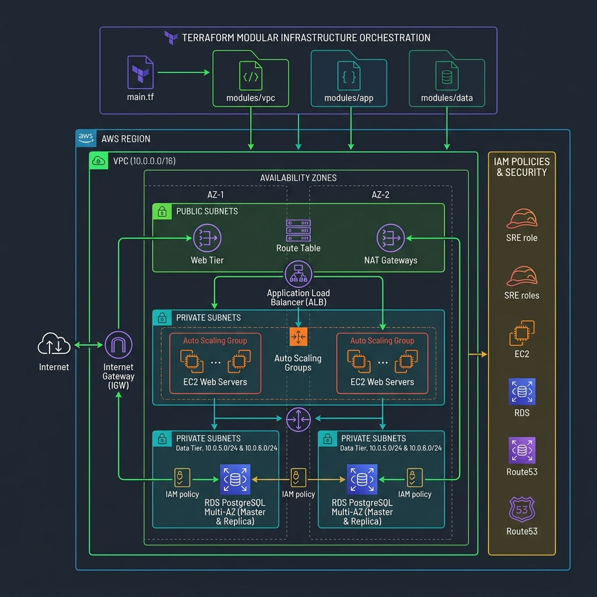
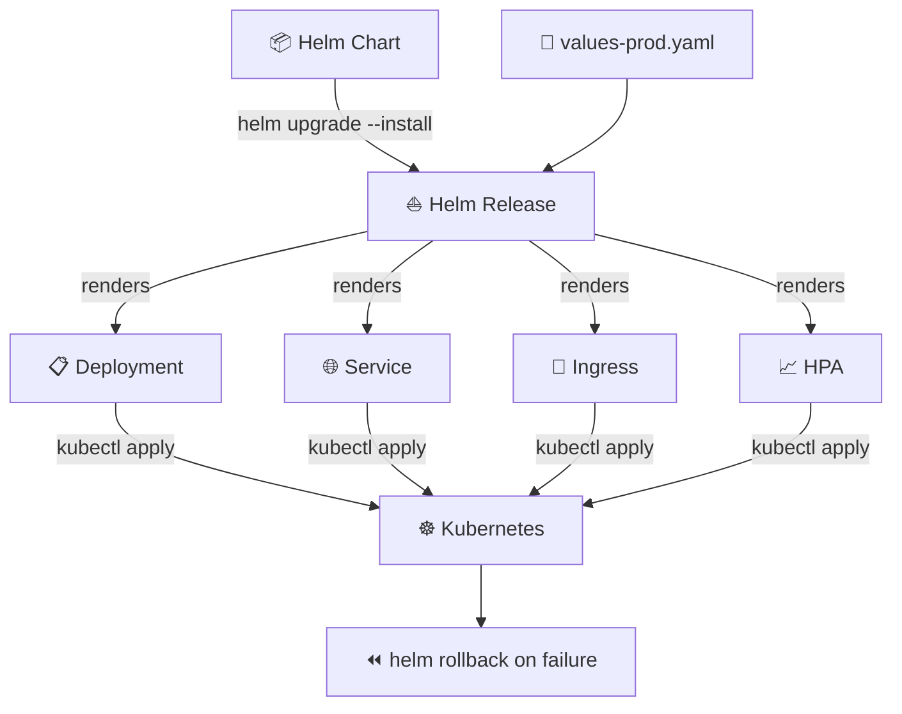

# ⛵ Helm Chart Scaffold Studio
> **Generate full package structures including Charts definitions, custom overrides values files, dynamic template deployments and ingresses.**

[](https://pradeeptalari14.github.io/portfolio/tools/helm/)
[]()

---

## 🎛️ Studio Options — What the UI Generates

The studio has multiple configurable options. Each combination produces different output files.
This repository contains **one working example per option variant** so you can learn by diffing.

### Output Tabs (files the studio generates)
| Tab | Description |
|-----|-------------|
| `Chart.yaml` | Generated in studio Output tab |
| `values.yaml` | Generated in studio Output tab |
| `templates/` | Generated in studio Output tab |
| `values-prod.yaml` | Generated in studio Output tab |
| `Flow Diagram` | Generated in studio Output tab |

### Configurable Options
| Option | Available Values |
|--------|-----------------|
| **Chart Type** | `Application` / `Library` |
| **Ingress** | `enabled` / `disabled` |
| **Autoscaling** | `HPA` / `KEDA` / `none` |
| **Service Type** | `ClusterIP` / `LoadBalancer` / `NodePort` |

---

## 🏗️ Architecture Flow Diagram





---

## 📁 Repository Structure

```
tp-helm/
├── README.md          ← This file — complete learning guide
├── charts/myapp/Chart.yaml
├── charts/myapp/values.yaml
├── charts/myapp/values-prod.yaml
├── charts/myapp/values-staging.yaml
├── charts/myapp/templates/deployment.yaml
├── scripts/deploy.sh
├── scripts/           ← Deployment + validation helpers
└── docs/USAGE.md      ← Extended usage guide
```

---

## 🚀 Step-by-Step Onboarding & Validation Guide

Follow these SRE steps to deploy, validate, and monitor this repository's workspace configs in a local or production environment:

#### 1. Prerequisites
- [x] **Terraform 1.5+**
- [x] **Kubectl & Helm 3.0+**
- [x] **AWS CLI / Google Cloud SDK configured**

#### 2. Download
Clone this repository locally:
```bash
git clone https://github.com/Pradeeptalari14/tp-helm.git
cd tp-helm
```

#### 3. Install
Fetch required packages and compile environment binaries:
```bash
terraform init || helm repo add stable https://charts.helm.sh/stable
```

#### 4. Enable Automatic Sidecar Injection
Enforce AWS Secret Manager sidecars or HashiCorp Vault Agent sidecars to inject dynamic credentials into resources.

#### 5. Install Kubernetes Gateway API CRDs
Deploy Kubernetes Gateway API custom resource definitions (CRDs) for cross-service route rules:
```bash
kubectl apply -f https://raw.githubusercontent.com/kubernetes-sigs/gateway-api/v1.1.0/config/crd/standard/gateway-api-v1.1.0-experimental.yaml
```

#### 6. Deploy Application Workload
Apply Terraform templates or apply Kubernetes deployment manifests:
```bash
terraform plan -out=tfplan
terraform apply tfplan
# Or apply manifests
kubectl apply -f deploy/
```

#### 7. Validate Application Inside Cluster
Inspect resources state and check running pods inside the cluster:
```bash
terraform show && kubectl get all -n production
```

#### 8. Expose Application Using Gateway
Expose target load balancer ingress gateways or forward local ports:
```bash
kubectl port-forward deployment/tp-helm 8080:8080
```

#### 9. Access the Application
Access service endpoints (printed in `terraform output`) or cluster local address [http://localhost:8080](http://localhost:8080).

#### 10. Install Addons
Install Karpenter autoscalers, AWS Load Balancer controllers, and ExternalDNS sync modules.

#### 11. Access Dashboard
Access EKS cloud dashboard, resource cost trackers, or local Kubernetes web consoles.

#### 12. View Service Mesh Graph
View resource dependencies diagram using `terraform graph` or inspect services topology structures.

#### 13. Generate Traffic
Inject test traffic loops to evaluate auto-scaling triggers:
```bash
kubectl run load-generator --image=busybox --restart=Never -- /bin/sh -c "while true; do wget -q -O- http://tp-helm; done"
```

#### 14. Project Structure
```text
tp-tp-helm/
├── .gitignore                # Version control exclusions
├── LICENSE                   # MIT Open Source License
├── SECURITY.md               # Vulnerability reporting protocols
├── CHANGELOG.md              # Releases version history
├── README.md                 # Project learning guide & onboarding
├── .env.example              # Template parameters config
├── .pre-commit-config.yaml   # Gitleaks & lint pipeline hooks
├── docs/
│   ├── USAGE.md              # Extended developer usage docs
│   ├── TROUBLESHOOTING.md    # Failures resolution guide
│   ├── GLOSSARY.md           # SRE domain terminology index
│   ├── COMPLIANCE.md         # Legal and security checks checklist
│   └── sre_architecture_flow.png # Category SRE architecture diagram
├── scripts/
│   └── validate.sh           # Local validation helper script
└── .github/
    ├── CONTRIBUTING.md       # Contributing instructions
    ├── PULL_REQUEST_TEMPLATE.md # Pull request code compliance check
    ├── ISSUE_TEMPLATE/       # Bug and features tickets
    ├── dependabot.yml        # Auto updates dependencies
    └── workflows/
        └── security-scan.yml # Gitleaks/yamllint/shellcheck scans

# Primary Config File: Chart.yaml
```

#### 15. Observability Components
Tracks cloud resource consumption metrics: node auto-scaling stats, CPU/Memory limit pools, and network requests.

#### 16. Install Monitoring
Triggers cloud alerts on cost budget breaches, node terminations, or replication failures.

---

## 📖 How Each Option Changes the Output

### Chart Type
- **`Application`** — see `examples/` folder for generated output
- **`Library`** — see `examples/` folder for generated output

### Ingress
- **`enabled`** — see `examples/` folder for generated output
- **`disabled`** — see `examples/` folder for generated output

### Autoscaling
- **`HPA`** — see `examples/` folder for generated output
- **`KEDA`** — see `examples/` folder for generated output
- **`none`** — see `examples/` folder for generated output

### Service Type
- **`ClusterIP`** — see `examples/` folder for generated output
- **`LoadBalancer`** — see `examples/` folder for generated output
- **`NodePort`** — see `examples/` folder for generated output

---

## 💡 SRE Compliance & Best Practices

| SRE Compliance Pillar | ❌ Anti-Pattern | ✅ Production Best Practice |
|---|---|---|
| **State Syncing** | Manually running manual kubectl tweaks on live clusters | Treat Git repository as the single source of truth; enforce Auto-Sync |
| **Value Pinning** | Using generic mutable image tags | Track immutable image digests in Helm values files for predictable rollouts |
| **Self-Healing** | Ignoring manual configuration drift | Enable ArgoCD Self-Healing to automatically revert manual cluster edits |

## 🔐 Security Standards

- ❌ Never commit credentials, API keys, or database passwords directly to Git repositories.
- ✅ Reference dynamic parameters using cloud Secret Managers (Vault, AWS SSM Parameter Store, Key Vault).
- ✅ Enforce branch protection rules: require peer pull request reviews and green status checks.

---

## 📖 Resources

| Resource | Link |
|----------|------|
| Interactive Studio | [Open →](https://pradeeptalari14.github.io/portfolio/tools/helm/) |
| All 91 Studios | [Dashboard →](https://pradeeptalari14.github.io/portfolio/tools/) |
| SRE Provisioning Guide | [Handbook →](https://github.com/Pradeeptalari14/portfolio/blob/main/GITHUB_PROVISIONING_GUIDE.md) |

---
*Generated by [Helm Chart Scaffold Studio Studio](https://pradeeptalari14.github.io/portfolio/tools/helm/) — [Talari Pradeep Portfolio](https://pradeeptalari14.github.io/portfolio)*