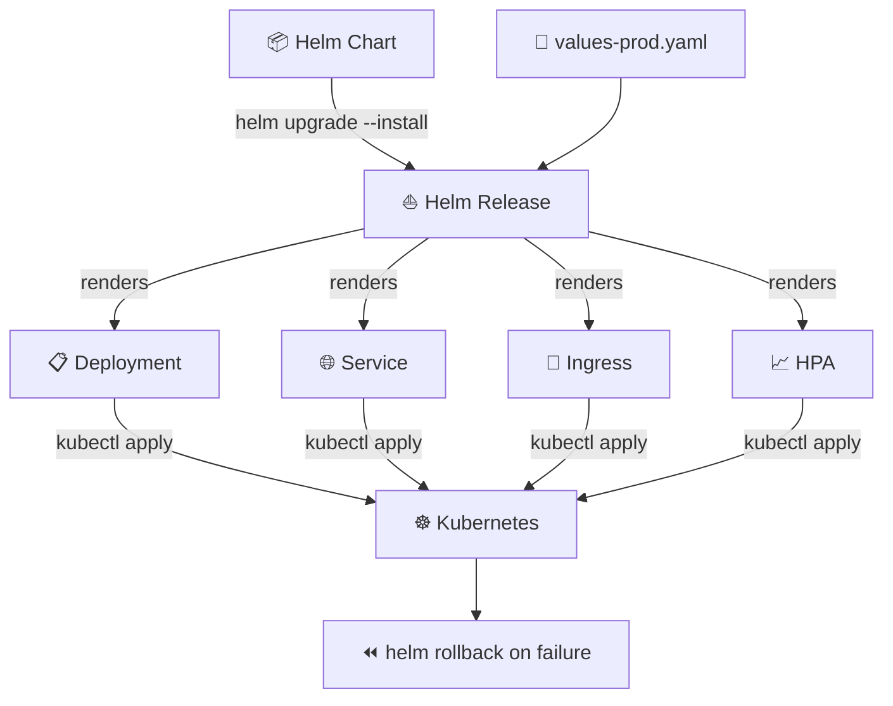

# ⛵ Helm Chart Scaffold Studio
> **Generate full package structures including Charts definitions, custom overrides values files, dynamic template deployments and ingresses.**

[](https://pradeeptalari14.github.io/portfolio/tools/helm/)
[]()

---

## 🎛️ Studio Options — What the UI Generates

The studio has multiple configurable options. Each combination produces different output files.
This repository contains **one working example per option variant** so you can learn by diffing.

### Output Tabs (files the studio generates)
| Tab | Description |
|-----|-------------|
| `Chart.yaml` | Generated in studio Output tab |
| `values.yaml` | Generated in studio Output tab |
| `templates/` | Generated in studio Output tab |
| `values-prod.yaml` | Generated in studio Output tab |
| `Flow Diagram` | Generated in studio Output tab |

### Configurable Options
| Option | Available Values |
|--------|-----------------|
| **Chart Type** | `Application` / `Library` |
| **Ingress** | `enabled` / `disabled` |
| **Autoscaling** | `HPA` / `KEDA` / `none` |
| **Service Type** | `ClusterIP` / `LoadBalancer` / `NodePort` |

---

## 🏗️ Architecture Flow Diagram



---

## 📁 Repository Structure

```
tp-helm/
├── README.md          ← This file — complete learning guide
├── charts/myapp/Chart.yaml
├── charts/myapp/values.yaml
├── charts/myapp/values-prod.yaml
├── charts/myapp/values-staging.yaml
├── charts/myapp/templates/deployment.yaml
├── scripts/deploy.sh
├── scripts/           ← Deployment + validation helpers
└── docs/USAGE.md      ← Extended usage guide
```

---

## ⚡ Quick Start

### Step 1 — Generate files from the Studio
1. Open **[Helm Chart Scaffold Studio Studio](https://pradeeptalari14.github.io/portfolio/tools/helm/)**
2. Select your option values in the UI
3. Watch the output update live in the editor
4. Click **Download** or **Copy** for each tab

### Step 2 — Use the example files in this repo
```bash
git clone https://github.com/Pradeeptalari14/tp-helm.git
cd tp-helm
# Browse examples/ to find the variant matching your needs
# Copy the relevant files into your project
```

---

## 🔄 Complete Start-to-End Workflow


---

## 📖 How Each Option Changes the Output

### Chart Type
- **`Application`** — see `examples/` folder for generated output
- **`Library`** — see `examples/` folder for generated output

### Ingress
- **`enabled`** — see `examples/` folder for generated output
- **`disabled`** — see `examples/` folder for generated output

### Autoscaling
- **`HPA`** — see `examples/` folder for generated output
- **`KEDA`** — see `examples/` folder for generated output
- **`none`** — see `examples/` folder for generated output

### Service Type
- **`ClusterIP`** — see `examples/` folder for generated output
- **`LoadBalancer`** — see `examples/` folder for generated output
- **`NodePort`** — see `examples/` folder for generated output

---

## 🔐 Security Best Practices

- ❌ Never commit credentials, API keys, or passwords
- ✅ Use environment variables or secret managers (Vault, AWS SSM, GitHub Secrets)
- ✅ Enable branch protection: require PR reviews + CI status checks
- ✅ Rotate credentials regularly and use least-privilege

---

## 📖 Resources

| Resource | Link |
|----------|------|
| Interactive Studio | [Open →](https://pradeeptalari14.github.io/portfolio/tools/helm/) |
| All 91 Studios | [Dashboard →](https://pradeeptalari14.github.io/portfolio/tools/) |
| SRE Provisioning Guide | [Handbook →](https://github.com/Pradeeptalari14/portfolio/blob/main/GITHUB_PROVISIONING_GUIDE.md) |

---
*Generated by [Helm Chart Scaffold Studio Studio](https://pradeeptalari14.github.io/portfolio/tools/helm/) — [Talari Pradeep Portfolio](https://pradeeptalari14.github.io/portfolio)*